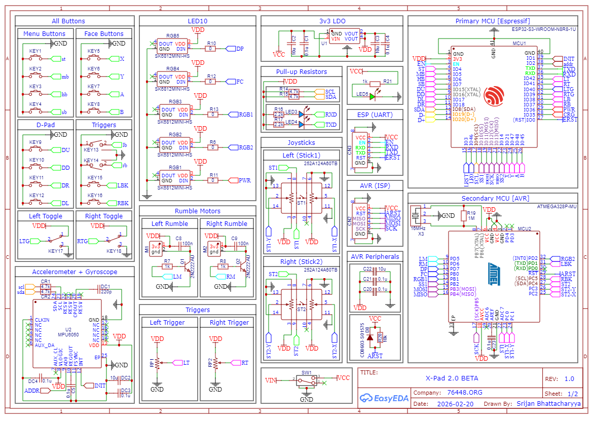
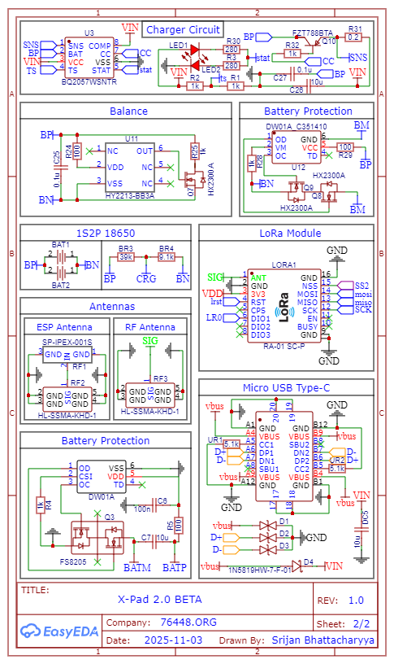

# X-Pad 2.0 🎮

<!-- **X-Pad 2.0** is a high-performance, multi-protocol hardware controller designed for professional gaming, long-range drone piloting, and advanced robotics. Engineered with a dual-MCU architecture, it bridges the gap between low-latency HID requirements and high-level wireless communication. -->

The **X-Pad 2.0** is a dual-MCU, _multi-protocol_ controller supporting five communication modes, featuring _motion sensing_, _RGB feedback_, advanced inputs, and _Xbox/PS_-style mapping, powered by a _2S2P 18650_ battery pack.

## 🚀 Key Features

- **Dual-MCU Architecture**: Powered by an **ESP32-S3-WROOM-1U** (Master) and an **ATmega328P-MU** (Slave) communicating via a high-speed SPI bus.
- **5-in-1 Connectivity**: Native support for **USB HID, BLE HID, LoRa (Ra-01 SC-P), WiFi HID, and ESP-NOW**.
- **Precision Control**: Featuring dual-axis joysticks, 8 tactile keys, dual triggers, and a dedicated D-pad.
- **Affective Feedback**: Integrated **SK6812MINI-HS** addressable RGB chain and dual rumble motors for immersive haptic and visual responses.
- **Motion Sensing**: Onboard **MPU6050** 6-axis IMU for motion tracking and gesture control0
- **Extended Endurance**: Powered by a **2S2P 18650** battery configuration with integrated BMS, cell balancing, and Type-C charging.

## 🛠 Hardware Specifications

### Core Components

| Component              | Description                                         |
| :--------------------- | :-------------------------------------------------- |
| **Primary MCU**        | ESP32-S3 (N8R8) - Handles BLE/WiFi/LoRa stacks.     |
| **Secondary MCU**      | ATmega328P-MU - Dedicated real-time I/O processing. |
| **LoRa Module**        | AI-Thinker Ra-01 SC-P for long-range telemetry.     |
| **IMU**                | MPU6050 Accelerometer + Gyroscope.                  |
| **Battery Management** | BQ2057W Li-ion charger with HY2213 balancing.       |

### Pin Mapping (SPI Bridge)

| Signal    | ESP32-S3 (Master) | ATmega328P (Slave) |
| :-------- | :---------------- | :----------------- |
| **MOSI**  | IO11              | PB3                |
| **MISO**  | IO13              | PB4                |
| **SCK**   | IO12              | PB5                |
| **SS/CS** | IO10              | PB2                |

### Project Schematics

**Page 1**

  

**Page 2**

  

<!-- ## 📂 Project Structure

- `/Firmware`: C++ source code for both ESP32 and ATmega328P.
- `/Hardware`: EasyEDA schematics and PCB layout files.
- `/Libraries`: C++ and Python wrapper libraries for third-party integration.
- `/Docs`: Technical datasheets and protocol specifications. -->

## ⚖️ License

Distributed under the [MIT License](LICENSE). See `LICENSE` for more information.

## 👤 Author

**Srijan Bhattacharyya**
